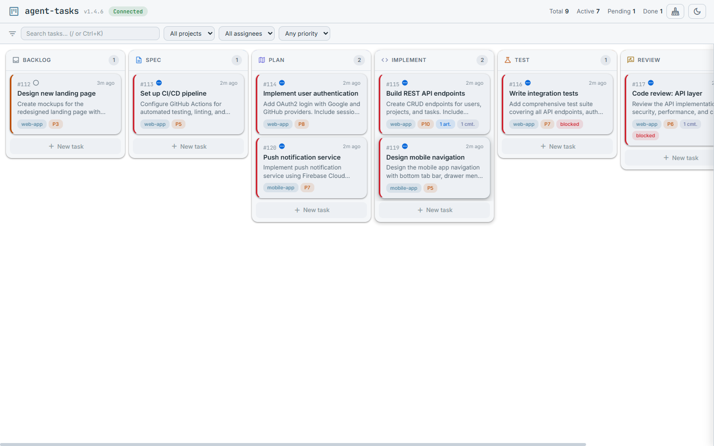
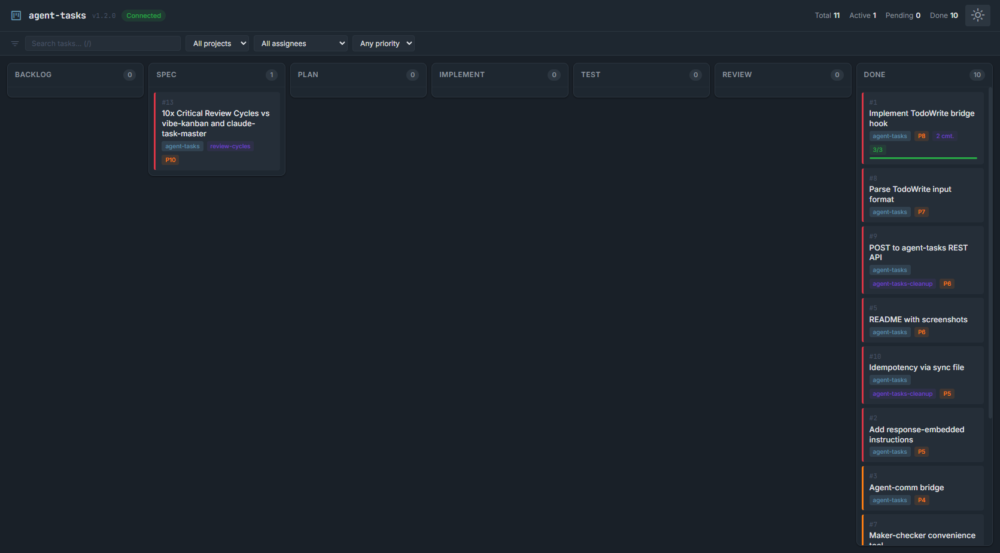

# agent-tasks

[](LICENSE)
[](https://nodejs.org/)
[]()
[]()
[]()

**Pipeline-driven task management for AI coding agents.** An [MCP](https://modelcontextprotocol.io/) server with stage-gated pipelines, multi-agent collaboration, and a real-time kanban dashboard. Tasks flow through configurable stages — `backlog`, `spec`, `plan`, `implement`, `test`, `review`, `done` — with dependency tracking, approval workflows, artifact versioning, and threaded comments.

Built for AI coding agents (Claude Code, Codex CLI, Gemini CLI, Aider) but works equally well with any MCP client, REST consumer, or WebSocket listener.

---

| Light Theme                                              | Dark Theme                                             |
| -------------------------------------------------------- | ------------------------------------------------------ |
|  |  |

---

## Why agent-tasks?

When you run multiple AI agents on the same codebase, they need a shared task pipeline — not just a flat todo list. They need stages, dependencies, approvals, and visibility.

---

## Features

- **Pipeline stages** — configurable per project: `backlog` > `spec` > `plan` > `implement` > `test` > `review` > `done`
- **Task dependencies** — DAG with automatic cycle detection; blocks advancement until resolved
- **Approval workflows** — stage-gated approve/reject with auto-regress on rejection
- **Multi-agent collaboration** — roles (collaborator, reviewer, watcher), claiming, assignment
- **Subtask hierarchies** — parent/child task trees with progress tracking
- **Threaded comments** — async discussions between agents on any task
- **Artifact versioning** — per-stage document attachments with automatic versioning and diff viewer
- **Full-text search** — FTS5 search across task titles and descriptions
- **Real-time kanban dashboard** — drag-and-drop, side panel, inline creation, dark/light theme
- **3 transport layers** — MCP (stdio), REST API (HTTP), WebSocket (real-time events)
- **TodoWrite bridge** — intercepts Claude Code's built-in TodoWrite and syncs to the pipeline
- **Agent bridge** — notifies connected agents on task events

---

## Quick Start

### Install from npm

```bash
npm install -g agent-tasks
```

### Or clone from source

```bash
git clone https://github.com/keshrath/agent-tasks.git
cd agent-tasks
npm install
npm run build
```

### Option 1: MCP server (for AI agents)

Add to your MCP client config (Claude Code, Cline, etc.):

```json
{
  "mcpServers": {
    "agent-tasks": {
      "command": "npx",
      "args": ["agent-tasks"]
    }
  }
}
```

The dashboard auto-starts at http://localhost:3422 on the first MCP connection.

### Option 2: Standalone server (for REST/WebSocket clients)

```bash
node dist/server.js --port 3422
```

---

## Claude Code Integration

Add agent-tasks as an MCP server in `~/.claude/settings.json`:

```json
{
  "mcpServers": {
    "agent-tasks": {
      "command": "node",
      "args": ["/path/to/agent-tasks/dist/index.js"]
    }
  }
}
```

Once configured, Claude Code can use all 33 MCP tools directly — creating tasks, advancing stages, adding artifacts, commenting, and more. See the [Setup Guide](docs/SETUP.md) for detailed integration steps.

---

## MCP Tools (33)

| Category                | Tools                                                                                                       |
| ----------------------- | ----------------------------------------------------------------------------------------------------------- |
| **Task lifecycle** (12) | `task_create`, `task_list`, `task_next`, `task_claim`, `task_advance`, `task_regress`, `task_complete`, ... |
| **Subtasks & deps** (4) | `task_expand`, `task_get_subtasks`, `task_add_dependency`, `task_remove_dependency`                         |
| **Artifacts** (2)       | `task_add_artifact`, `task_get_artifacts`                                                                   |
| **Comments** (2)        | `task_comment`, `task_get_comments`                                                                         |
| **Collaboration** (2)   | `task_add_collaborator`, `task_remove_collaborator`                                                         |
| **Approvals** (5)       | `task_request_approval`, `task_approve`, `task_reject`, `task_pending_approvals`, `task_review_cycle`       |
| **Config & utils** (4)  | `task_pipeline_config`, `task_set_session`, `task_cleanup`, `task_generate_rules`                           |

See [full API reference](docs/api.md) for detailed descriptions of every tool and endpoint.

## REST API (18 endpoints)

All endpoints return JSON. CORS enabled. See [full API reference](docs/api.md#rest-api-18-endpoints) for details.

```
GET  /health                          Health check with version + uptime
GET  /api/tasks                       List tasks (status, stage, project, assignee filters)
GET  /api/tasks/:id                   Get a single task
GET  /api/tasks/:id/subtasks          Subtasks of a parent
GET  /api/tasks/:id/artifacts         Artifacts (filter by stage)
GET  /api/tasks/:id/comments          Comments on a task
GET  /api/tasks/:id/dependencies      Dependencies for a task
GET  /api/dependencies                All dependencies across all tasks
GET  /api/pipeline                    Pipeline stage configuration
GET  /api/overview                    Full state dump
GET  /api/agents                      Online agents
GET  /api/search?q=                   Full-text search

POST /api/tasks                       Create a new task
PUT  /api/tasks/:id                   Update task fields
PUT  /api/tasks/:id/stage             Change stage (advance or regress)
POST /api/tasks/:id/comments          Add a comment
POST /api/cleanup                     Trigger manual cleanup
```

---

## Testing

```bash
npm test              # 337 tests across 12 suites
npm run test:watch    # Watch mode
npm run test:coverage # Coverage report
npm run check         # Full CI: typecheck + lint + format + test
```

---

## Environment variables

| Variable                   | Default                         | Description                                          |
| -------------------------- | ------------------------------- | ---------------------------------------------------- |
| `AGENT_TASKS_DB`           | `~/.agent-tasks/agent-tasks.db` | SQLite database file path                            |
| `AGENT_TASKS_PORT`         | `3422`                          | Dashboard HTTP/WebSocket port                        |
| `AGENT_TASKS_INSTRUCTIONS` | enabled                         | Set to `0` to disable response-embedded instructions |
| `AGENT_COMM_URL`           | `http://localhost:3421`         | Agent-comm REST URL for bridge notifications         |

---

## Documentation

- [API Reference](docs/api.md) — all 33 MCP tools, 18 REST endpoints, WebSocket protocol
- [Architecture](docs/architecture.md) — source structure, design principles, database schema
- [Dashboard](docs/dashboard.md) — kanban board features, keyboard shortcuts, screenshots
- [Hooks](docs/hooks.md) — TodoWrite bridge hook for Claude Code
- [Setup Guide](docs/SETUP.md) — detailed installation, integration, and configuration
- [Changelog](CHANGELOG.md)

---

## License

MIT — see [LICENSE](LICENSE)
