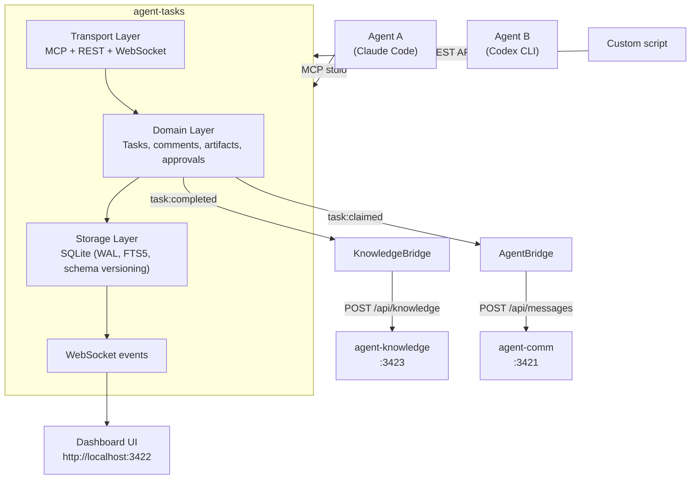

# Architecture

## Source structure

```
src/
├── types.ts              # Shared types, error hierarchy (TasksError -> NotFound/Conflict/Validation)
├── context.ts            # DI root — creates and wires all services, no global state
├── package-meta.ts       # Reads name/version from package.json (MCP initialize, WebSocket state)
├── index.ts              # MCP entry point (stdio JSON-RPC) + dashboard auto-start
├── server.ts             # HTTP + WebSocket server (standalone or embedded)
├── domain/
│   ├── tasks.ts          # Pipeline logic, CRUD, search, subtasks, dependencies
│   ├── comments.ts       # Threaded comments
│   ├── collaborators.ts  # Multi-agent collaboration with roles
│   ├── approvals.ts      # Stage-gated approval workflows
│   ├── agent-bridge.ts   # Agent-comm notification bridge (soft dep, HTTP, fail-open)
│   ├── knowledge-bridge.ts # Agent-knowledge integration bridge (soft dep, HTTP, fail-open)
│   ├── rules.ts          # IDE rule generation (.mdc, CLAUDE.md)
│   ├── events.ts         # In-process event bus
│   └── validate.ts       # Input validation constants
├── storage/
│   └── database.ts       # SQLite (WAL mode, schema versioning, FK cascades, FTS5)
├── transport/
│   ├── mcp.ts            # 8 MCP tool definitions + dispatch (handlers: mcp-handlers.ts)
│   ├── rest.ts           # 19 REST endpoints + static file serving
│   └── ws.ts             # WebSocket event streaming + livereload
└── ui/
    ├── index.html        # Dashboard (vanilla HTML)
    ├── app.js            # Kanban client (vanilla JS, no framework)
    └── styles.css        # Light/dark theme, responsive layout
```

## Design principles

- **No frameworks** — no React, Vue, Express, or Fastify. Pure Node.js + TypeScript.
- **Domain-driven design** — business logic in `domain/`, storage in `storage/`, transport in `transport/`
- **Dependency injection** — `context.ts` wires all services; no global state
- **3 runtime deps** — `better-sqlite3`, `uuid`, `ws`
- **Typed errors** — `TasksError` hierarchy with HTTP status codes (400, 404, 409, 422)
- **Input validation** — runtime type checking on all MCP tool inputs
- **SQLite with WAL mode** — concurrent reads, single-writer, schema versioning with idempotent migrations
- **morphdom** — efficient DOM diffing for the dashboard (no virtual DOM framework needed)
- **marked + DOMPurify + highlight.js** — Markdown rendering with XSS protection and syntax highlighting

## Architecture diagram



## Soft dependencies

agent-tasks integrates with two sibling MCP servers via HTTP. Both are fail-open — agent-tasks works standalone.

| Service             | Bridge class      | Env var               | Default                 | Purpose                                                |
| ------------------- | ----------------- | --------------------- | ----------------------- | ------------------------------------------------------ |
| **agent-comm**      | `AgentBridge`     | `AGENT_COMM_URL`      | `http://localhost:3421` | Notifications on claim/advance, agent list for cleanup |
| **agent-knowledge** | `KnowledgeBridge` | `AGENT_KNOWLEDGE_URL` | `http://localhost:3423` | Push learning/decision artifacts on task completion    |

### AgentBridge (`agent-bridge.ts`)

Listens to task lifecycle events and forwards notifications to agents via agent-comm's REST API.

**Events handled:**

| Event                | Action                                                                   |
| -------------------- | ------------------------------------------------------------------------ |
| `task:claimed`       | Direct message to the assigned agent: "Task #N has been assigned to you" |
| `task:advanced`      | Direct message to the assigned agent: "Task #N advanced to {stage}"      |
| `comment:created`    | Channel post to `general`: "Comment on task #N by {agent}"               |
| `approval:requested` | Direct message to the reviewer: "Approval requested for task #N"         |

Also exposes `fetchAgents()` which queries `GET /api/agents` on agent-comm — used by `CleanupService` to detect stale agent sessions and auto-fail their orphaned tasks.

### KnowledgeBridge (`knowledge-bridge.ts`)

Listens to `task:completed` events and pushes learning/decision artifacts to agent-knowledge via `POST /api/knowledge`.

**Flow:**

1. On `task:completed`, queries the DB for artifacts named `learning` or `decision` on the completed task
2. If none found, exits (most tasks have no learnings — this is a no-op path)
3. For each learning/decision artifact, formats a markdown entry with YAML frontmatter:
   - `title`: "Task #{id}: {title} — {Learning|Decision}"
   - `tags`: `[agent-tasks, {learning|decision}, {project}]`
   - `confidence: extracted`, `source: agent-tasks`
   - Context block: task ID, project, assignee, completion timestamp, stage
   - Full artifact content
4. POSTs each entry to `POST /api/knowledge` with `category: "decisions"`
5. All POSTs are fire-and-forget — errors are silently swallowed (fail-open)

**Filename convention:** `task-{id}-{learning|decision}-{n}.md` (e.g. `task-42-learning-1.md`)

The entries land in `~/agent-knowledge/decisions/` and are auto-indexed with embeddings, auto-linked to similar entries (cosine > 0.7), and git-synced — all handled by the agent-knowledge POST endpoint.

## Database

SQLite with WAL mode at `~/.agent-tasks/agent-tasks.db`. Schema is versioned with automatic migrations (currently V4).

### Tables

- **tasks** — id, title, description, status, stage, priority, project, assigned_to, parent_id, tags, result, created_by, timestamps
- **task_dependencies** — task_id -> depends_on_id (DAG with cycle detection)
- **task_artifacts** — name + stage + task_id identity; version auto-incremented, previous_id links history
- **task_comments** — threaded via parent_comment_id; agent_id tracks author
- **task_collaborators** — task_id + agent_id + role (collaborator/reviewer/watcher)
- **task_approvals** — task_id + stage + status (pending/approved/rejected); blocks advancement
- **task_search** — FTS5 virtual table with triggers for automatic sync

All tables use foreign key constraints with `ON DELETE CASCADE`.

### Automatic cleanup

The `task_config(action: "cleanup")` tool and `POST /api/cleanup` endpoint remove completed/cancelled tasks older than a configurable retention period (default: 7 days). This cleans up tasks and all related data (artifacts, comments, collaborators, approvals, dependencies).

## Status transitions

```
pending -> in_progress (claim)
in_progress -> completed (complete) | failed (fail)
any non-terminal -> cancelled (cancel)
```

## Stage transitions

Tasks advance sequentially through the configured pipeline stages. Dependencies block advancement until all dependencies are resolved. Regression to any earlier stage is allowed with a reason artifact.

Default pipeline: `backlog` > `spec` > `plan` > `implement` > `test` > `review` > `done`

Configurable per project via `task_config(action: "pipeline")`.

## Cross-process sync

MCP servers run as separate stdio processes (one per Claude Code session). The WebSocket server polls the SQLite database every 2 seconds to detect changes made by other processes. This ensures the dashboard stays in sync across multiple concurrent sessions.

## Development

```bash
npm run dev          # Live reload (tsc watch + nodemon)
npm run lint         # ESLint
npm run lint:fix     # ESLint with auto-fix
npm run format       # Prettier
npm run typecheck    # TypeScript strict mode check
npm run check        # Full CI: typecheck + lint + format + test
```

## Test suites

| Suite                 | Tests | What it covers                                               |
| --------------------- | ----- | ------------------------------------------------------------ |
| Domain: Tasks         | ~80   | CRUD, stages, dependencies, subtasks, search, claiming       |
| Domain: Comments      | ~20   | Threading, agent tracking, task linking                      |
| Domain: Collaborators | ~20   | Roles, assignment, removal, validation                       |
| Domain: Approvals     | ~30   | Request, approve, reject, review cycles, stage gating        |
| Domain: Artifacts     | ~25   | Versioning, per-stage, previous_id linking                   |
| Domain: Events        | ~10   | Pub/sub, event types, error isolation                        |
| Domain: Edge cases    | ~40   | Boundary values, validation, concurrency, data integrity     |
| Transport: MCP        | ~35   | All 16 tools, input validation, error formatting             |
| Transport: REST       | ~30   | All 19 endpoints, query params, error codes                  |
| Integration           | ~25   | Multi-agent workflows, pipeline traversal, dependency chains |
| E2E                   | ~22   | Server startup, WebSocket state, REST + WS interaction       |
