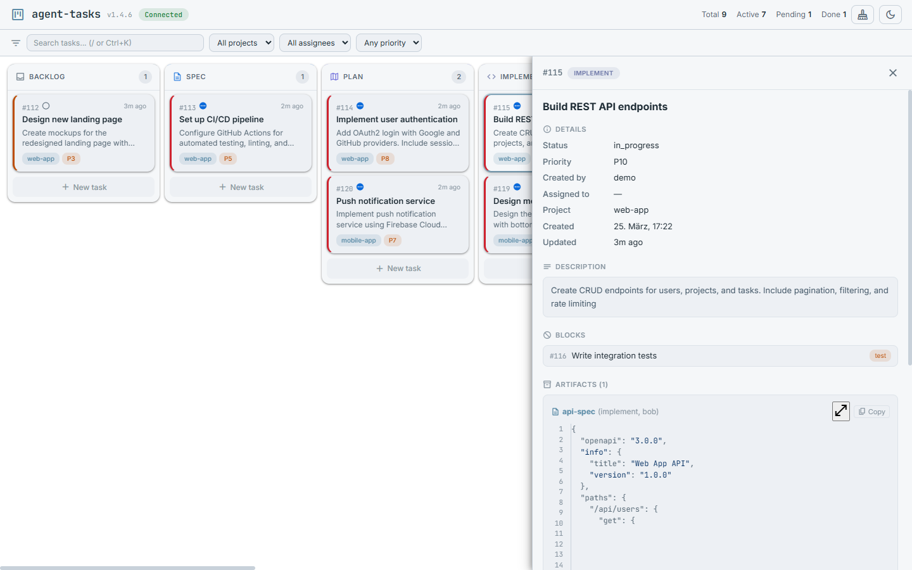
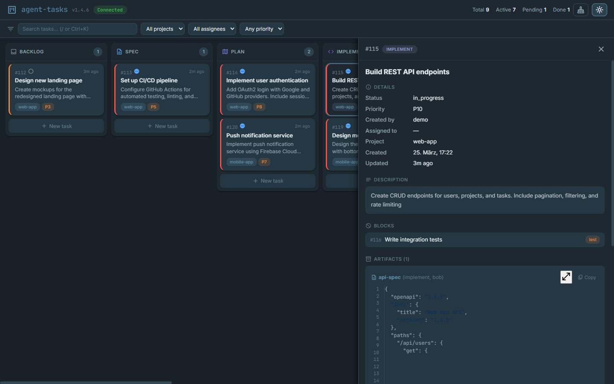
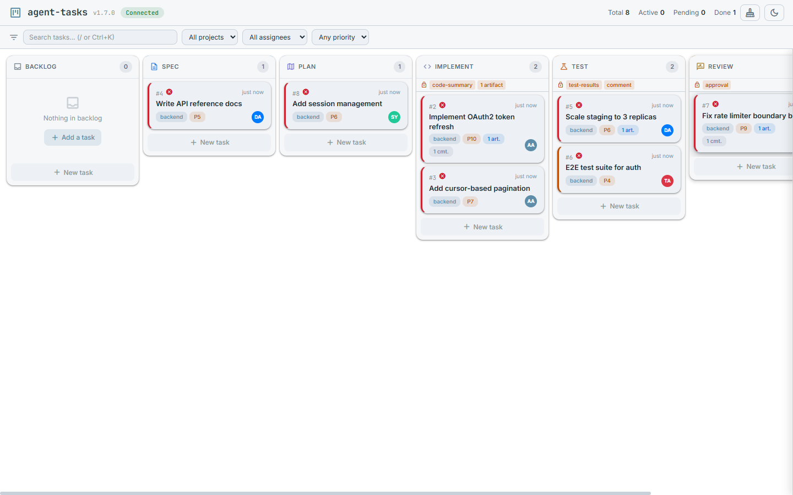
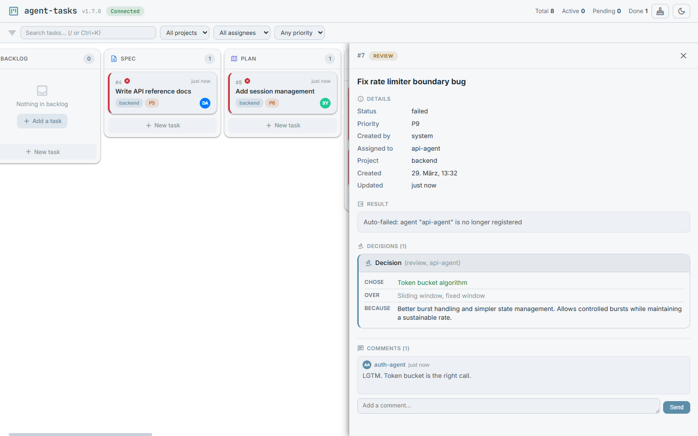
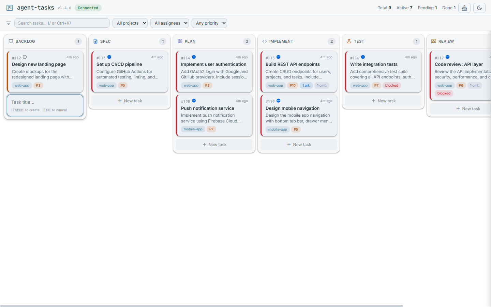
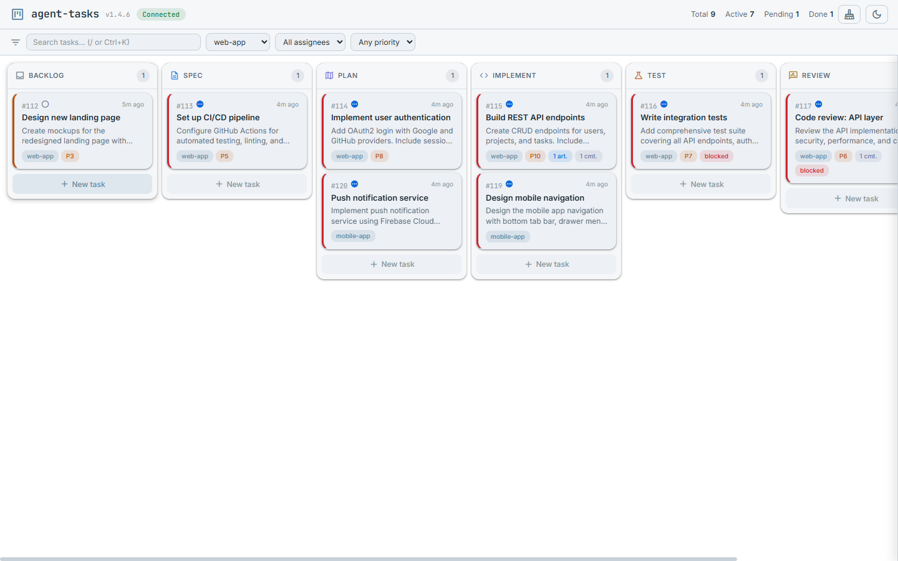
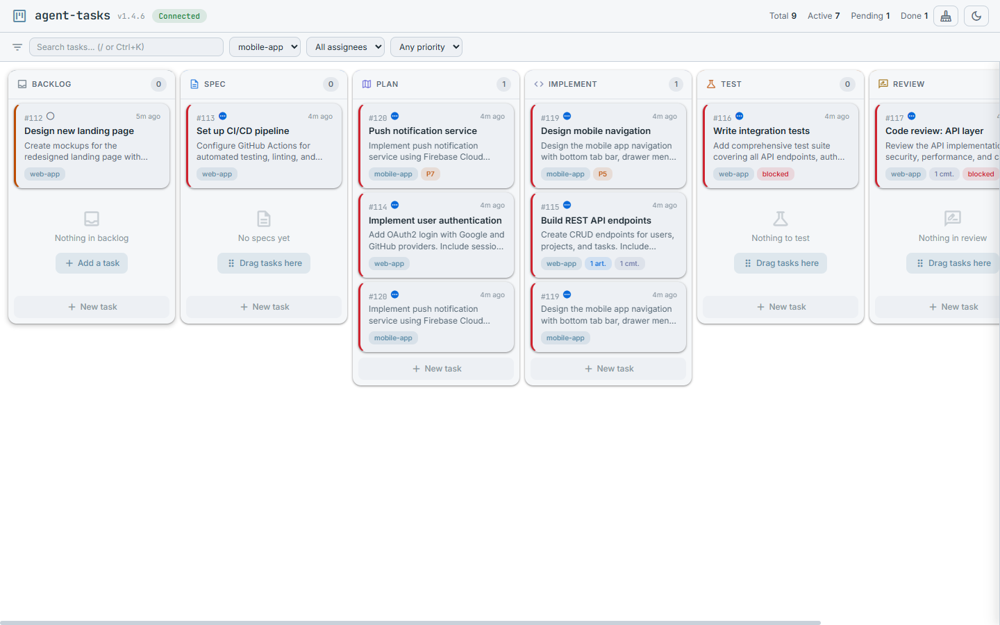

# Dashboard

Auto-starts at `http://localhost:3422` on first MCP connection, or run standalone with `node dist/server.js`.

## Kanban board layout

The dashboard displays tasks as cards organized into columns — one per pipeline stage. Each card shows the task title, priority badge, project tag, assignee avatar, and counts for artifacts, comments, and subtasks.

| Light Theme                               | Dark Theme                              |
| ----------------------------------------- | --------------------------------------- |
|  |  |

## Side panel

Click any task card to open the side panel on the right. The panel shows:

- Full task details (title, description rendered as Markdown, status, stage, priority)
- Inline editing for all fields
- Stage advancement/regression buttons
- Artifacts list with expandable content, syntax highlighting, and version diffs
- Comments thread with Markdown rendering
- Dependencies and subtask progress
- Collaborator list with roles

| Side panel (light)                   | Side panel (dark)                              |
| ------------------------------------ | ---------------------------------------------- |
|  |  |

## Stage gate indicators

When a project has stage gates configured (via `task_pipeline_config`), the column header shows a lock icon with the gate requirements as orange pills. This gives visual feedback about what's needed before tasks can advance.

For example, if the `implement` stage requires a `code-summary` artifact, the column header shows:

```
🔒 code-summary
```

Gate types displayed: named artifact requirements, minimum artifact counts, comment requirements, and approval requirements. Gates are configured per project — see the [Setup Guide](SETUP.md#per-stage-gate-guards) for configuration.



## Decisions

The side panel separates decision artifacts from regular artifacts. Decisions created via `task_decision` are rendered as structured cards with:

- **Chose** — the selected option (highlighted green)
- **Over** — the alternatives considered
- **Because** — the rationale

Decisions appear in their own "Decisions" section (with a gavel icon) above the regular "Artifacts" section, making architectural choices easy to find and review.



## Inline creation

Each column has an "Add task" button at the bottom. Click it to reveal an inline form — enter a title (and optionally a description) and press Enter. The task is created directly in that stage.



## Drag and drop

Drag task cards between columns to advance or regress them through stages. The board auto-scrolls when dragging near edges. Drop zones highlight on hover.

## Filters and search

The filter bar at the top provides:

- **Text search** — matches task titles and descriptions (press `/` or `Ctrl+K` to focus)
- **Project filter** — dropdown populated from existing tasks
- **Assignee filter** — dropdown populated from existing tasks
- **Priority filter** — minimum priority threshold (P1+, P3+, P5+, P10+)
- **Filter chips** — active filters shown as removable chips



## Dark mode

Toggle between light and dark themes with the moon/sun icon in the header. Theme preference is persisted in localStorage.

## Empty states

Columns with no tasks display a helpful empty state with an icon and hint text.



## Keyboard shortcuts

| Key             | Action                                       |
| --------------- | -------------------------------------------- |
| `/` or `Ctrl+K` | Focus the search input                       |
| `Escape`        | Close the side panel, modal, or clear search |

## Features

- Light + dark theme (persisted in localStorage)
- Real-time WebSocket updates with DB polling for cross-process sync
- Full markdown rendering (GFM, code blocks, tables) via marked + DOMPurify
- Syntax highlighting in code blocks via highlight.js
- Expandable/collapsible artifacts with version diffs
- Decision cards with structured Chose/Over/Because rendering
- Stage gate indicators on column headers (lock icon + requirement pills)
- Threaded comments with Markdown rendering
- Drag-and-drop between stage columns with auto-scroll
- Full-text search powered by FTS5
- Project/assignee/priority filtering with removable chips
- ARIA attributes for accessibility
- Mobile responsive layout

## WebSocket protocol

The dashboard connects via WebSocket for real-time updates:

- **On connect:** receives full state snapshot (`type: "state"`) with tasks, dependencies, artifact/comment counts, stages, gate configs, and collaborators
- **Incremental events:** streamed as tasks change
- **Polling:** server polls SQLite every 2s to detect cross-process changes (MCP stdio servers)
