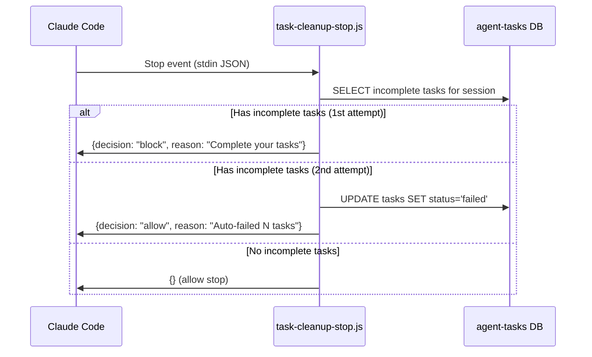
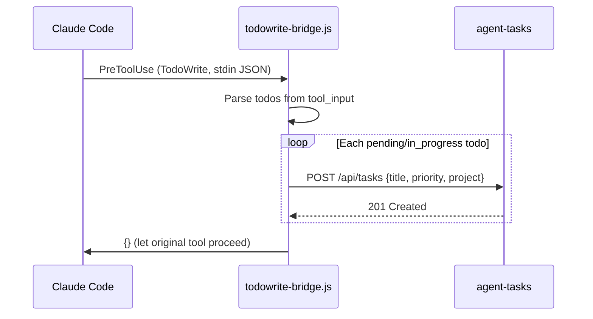

# Setup Guide

Detailed instructions for installing, configuring, and integrating agent-tasks with any MCP client.

## Table of Contents

- [Prerequisites](#prerequisites)
- [Installation](#installation)
- [Client Setup](#client-setup)
  - [Claude Code](#claude-code)
  - [OpenCode](#opencode)
  - [Cursor](#cursor)
  - [Windsurf](#windsurf)
  - [REST API](#rest-api)
- [Hooks](#hooks)
  - [Claude Code Hooks](#claude-code-hooks)
  - [OpenCode Plugins](#opencode-plugins)
  - [Cursor and Windsurf](#cursor-and-windsurf)
- [Running as Standalone Server](#running-as-standalone-server)
- [Configuration Options](#configuration-options)
- [Database](#database)
- [Troubleshooting](#troubleshooting)

---

## Prerequisites

- **Node.js** >= 20.11 (for native ES module support and `node:` built-in imports)
- **npm** >= 10

```bash
node --version   # v20.11.0 or later
npm --version    # v10 or later
```

---

## Installation

### From npm

```bash
npm install -g agent-tasks
```

### From source

```bash
git clone https://github.com/keshrath/agent-tasks.git
cd agent-tasks
npm install
npm run build
```

This compiles TypeScript to `dist/` and copies UI files to `dist/ui/`.

### Verify

```bash
node dist/server.js
```

Open **http://localhost:3422** — you should see the kanban dashboard with empty columns for each pipeline stage.

---

## Client Setup

agent-tasks works with any MCP client (stdio) or HTTP client (REST API). Pick your client below.

### Claude Code

#### Step 1: Add the MCP server

Edit `~/.claude/settings.json`:

```json
{
  "mcpServers": {
    "agent-tasks": {
      "command": "npx",
      "args": ["agent-tasks"]
    }
  },
  "permissions": {
    "allow": ["mcp__agent-tasks__*"]
  }
}
```

#### Step 2: Verify

Start a new Claude Code session. Try:

> Create a task called "Test task" with priority 5

Claude should call `task_create` and confirm the task was created.

#### Step 3: Open the dashboard

The dashboard auto-starts at **http://localhost:3422**.

### OpenCode

`opencode.json` (project root) or `~/.config/opencode/opencode.json` (global):

```json
{
  "$schema": "https://opencode.ai/config.json",
  "mcp": {
    "agent-tasks": {
      "type": "local",
      "command": ["node", "/absolute/path/to/agent-tasks/dist/index.js"],
      "environment": {
        "AGENT_TASKS_PORT": "3422"
      }
    }
  }
}
```

### Cursor

`.cursor/mcp.json` in your project root:

```json
{
  "mcpServers": {
    "agent-tasks": {
      "command": "node",
      "args": ["/absolute/path/to/agent-tasks/dist/index.js"],
      "env": {
        "AGENT_TASKS_PORT": "3422"
      }
    }
  }
}
```

### Windsurf

`~/.codeium/windsurf/mcp_config.json`:

```json
{
  "mcpServers": {
    "agent-tasks": {
      "command": "node",
      "args": ["/absolute/path/to/agent-tasks/dist/index.js"],
      "env": {
        "AGENT_TASKS_PORT": "3422"
      }
    }
  }
}
```

### REST API

If your tool doesn't support MCP, use the REST API:

```bash
# Create a task
curl -X POST http://localhost:3422/api/tasks \
  -H 'Content-Type: application/json' \
  -d '{"title": "Fix login bug", "priority": 5, "project": "backend"}'

# List tasks
curl http://localhost:3422/api/tasks

# Advance a task
curl -X POST http://localhost:3422/api/tasks/1/advance
```

See [API.md](API.md) for the full REST reference.

---

## Hooks

Hooks automate pipeline workflows — dashboard announcements, TodoWrite bridging, and task cleanup. Support varies by client.

### Claude Code Hooks

agent-tasks ships with 4 hook scripts. Add all of them to `~/.claude/settings.json`:

```json
{
  "hooks": {
    "SessionStart": [
      {
        "hooks": [
          {
            "type": "command",
            "command": "node \"/path/to/agent-tasks/scripts/hooks/session-start.js\"",
            "timeout": 5
          },
          {
            "type": "command",
            "command": "node \"/path/to/agent-tasks/scripts/hooks/task-cleanup-start.js\"",
            "timeout": 10
          }
        ]
      }
    ],
    "PreToolUse": [
      {
        "hooks": [
          {
            "type": "command",
            "command": "node \"$HOME/.claude/hooks/todowrite-bridge.js\"",
            "timeout": 5
          }
        ]
      }
    ],
    "Stop": [
      {
        "hooks": [
          {
            "type": "command",
            "command": "node \"/path/to/agent-tasks/scripts/hooks/task-cleanup-stop.js\"",
            "timeout": 10
          }
        ]
      }
    ],
    "SubagentStop": [
      {
        "hooks": [
          {
            "type": "command",
            "command": "node \"/path/to/agent-tasks/scripts/hooks/task-cleanup-stop.js\"",
            "timeout": 10
          }
        ]
      }
    ]
  }
}
```

Replace `/path/to/agent-tasks` with the actual path (or use `npx` paths if installed globally).

| Hook                    | Event               | Purpose                                     |
| ----------------------- | ------------------- | ------------------------------------------- |
| `session-start.js`      | SessionStart        | Announces dashboard URL                     |
| `task-cleanup-start.js` | SessionStart        | Auto-fails tasks from dead sessions         |
| `todowrite-bridge.js`   | PreToolUse          | Syncs TodoWrite to pipeline                 |
| `task-cleanup-stop.js`  | Stop + SubagentStop | Blocks stop, then auto-fails orphaned tasks |

#### Task Cleanup — Stop (`scripts/hooks/task-cleanup-stop.js`)

Prevents sessions from ending with incomplete tasks. Runs on both `Stop` (main session) and `SubagentStop` (spawned agents).

1. **First stop attempt**: Blocks and lists all incomplete tasks assigned to the session. Tells Claude to call `task_complete` or `task_fail` for each.
2. **Second stop attempt**: Auto-fails all remaining tasks with reason `"Session ended without completing this task (auto-cleanup)"` and allows stop.



The block counter is stored in `~/.claude/task-cleanup-counter.json`. To change the number of blocks before auto-cleanup, edit `MAX_BLOCKS` in the script (default: 1).

#### Task Cleanup — Session Start (`scripts/hooks/task-cleanup-start.js`)

Catches tasks orphaned by sessions that crashed, were killed, or otherwise ended without the Stop hook firing.

On every session start:

1. Finds all tasks assigned to sessions that no longer have a `hub-session.*.json` file
2. Auto-fails them with reason `"Session no longer running (stale task cleanup on session start)"`
3. Logs the cleanup to stderr

This is the safety net — even if the Stop hook never fires, the next session to start will clean up.

#### TodoWrite Bridge (`~/.claude/hooks/todowrite-bridge.js`)

Intercepts Claude Code's built-in `TodoWrite` tool and syncs todos to agent-tasks. Every todo Claude creates automatically appears on the kanban board.

When Claude Code calls `TodoWrite`, the hook:

1. Reads the tool input from stdin
2. Extracts todos with `in_progress` or `pending` status
3. POSTs each as a new task to `http://localhost:3422/api/tasks`
4. Maps priority: `high` -> 10, `medium` -> 5, `low` -> 1
5. Tags all synced tasks with project `claude-todos`
6. Returns an empty JSON object to let the original tool proceed



| Variable          | Default                 | Description                   |
| ----------------- | ----------------------- | ----------------------------- |
| `AGENT_TASKS_URL` | `http://localhost:3422` | agent-tasks REST API base URL |

The hook has a 3-second timeout per request. If agent-tasks is not running, it silently fails and lets `TodoWrite` proceed.

### OpenCode Plugins

OpenCode supports lifecycle hooks via JavaScript/TypeScript plugins. Create a plugin in `.opencode/plugins/` or `~/.config/opencode/plugins/`:

```typescript
// .opencode/plugins/agent-tasks.ts
import type { Plugin } from '@opencode-ai/plugin';

export const AgentTasksPlugin: Plugin = async ({ client }) => {
  return {
    event: async (event) => {
      if (event.type === 'session.created') {
        // Equivalent to SessionStart — agent sees pipeline instructions via AGENTS.md
      }
      if (event.type === 'tool.execute.before') {
        // Equivalent to PreToolUse — could intercept todo creation
      }
    },
  };
};
```

Available events: `session.created`, `session.idle`, `tool.execute.before`, `tool.execute.after`, `message.updated`, `file.edited`.

Combine with `AGENTS.md` instructions (see below).

### Cursor and Windsurf

Cursor and Windsurf don't support lifecycle hooks. Use the client's system prompt / instructions file:

| Client   | Instructions file |
| -------- | ----------------- |
| Cursor   | `.cursorrules`    |
| Windsurf | `.windsurfrules`  |

Add these instructions:

```
You have access to agent-tasks MCP tools for tracking work through a pipeline.

Pipeline stages: backlog > spec > plan > implement > test > review > done

When given work:
1. Create a task with task_create
2. Claim it with task_claim
3. Advance through stages with task_advance as you progress
4. Attach artifacts at each stage with task_add_artifact
5. Complete with task_complete when done

Always check task_list first to see what's in flight.
Dashboard: http://localhost:3422
```

The TodoWrite bridge is Claude Code-specific. Other clients should use `task_create` directly.

---

## Running as Standalone Server

```bash
# Default port (3422)
npm run start:server

# Custom port
npm run start:server -- --port 8080

# Or directly
node dist/server.js --port 8080
```

Useful for viewing the dashboard while MCP servers run in separate terminals, or integrating via REST API.

---

## Configuration Options

### Environment variables

| Variable                   | Default                         | Description                                                       |
| -------------------------- | ------------------------------- | ----------------------------------------------------------------- |
| `AGENT_TASKS_DB`           | `~/.agent-tasks/agent-tasks.db` | Path to the SQLite database file                                  |
| `AGENT_TASKS_PORT`         | `3422`                          | HTTP/WebSocket port for the dashboard                             |
| `AGENT_TASKS_INSTRUCTIONS` | enabled                         | Set to `0` to disable embedded instructions in MCP tool responses |
| `AGENT_COMM_URL`           | `http://localhost:3421`         | Agent-comm REST API URL (for bridge notifications)                |

### Custom pipeline stages

The default pipeline is: `backlog` > `spec` > `plan` > `implement` > `test` > `review` > `done`

You can customize stages per project using the `task_pipeline_config` MCP tool:

```
Use task_pipeline_config to set stages for project "my-project" to: ["todo", "doing", "testing", "done"]
```

Or via REST:

```bash
# Get current pipeline config
curl http://localhost:3422/api/pipeline

# Get pipeline for a specific project
curl http://localhost:3422/api/pipeline?project=my-project
```

---

## Database

### Location

By default, the database is stored at `~/.agent-tasks/agent-tasks.db`. Override with `AGENT_TASKS_DB`.

### Backup

```bash
cp ~/.agent-tasks/agent-tasks.db ~/.agent-tasks/agent-tasks.db.bak
```

### Reset

```bash
rm ~/.agent-tasks/agent-tasks.db
```

A new database will be created automatically on the next start.

### Schema

The database uses schema versioning (currently V3) with automatic migrations. Migrations are idempotent.

---

## Troubleshooting

### Dashboard shows "Connecting..."

- Verify the server is running: `curl http://localhost:3422/health`
- Check the port isn't in use: `lsof -i :3422` (macOS/Linux) or `netstat -ano | findstr 3422` (Windows)
- Try a different port: `AGENT_TASKS_PORT=8080 npm run start:server`

### MCP tools not appearing

- Verify the path in your config is absolute and points to `dist/index.js`
- Ensure you ran `npm run build` after cloning
- Restart your client after changing config

### Tasks not syncing between terminals

- The WebSocket server polls SQLite every 2 seconds to detect cross-process changes
- Ensure all MCP instances use the same database file (`AGENT_TASKS_DB`)

### TodoWrite bridge not working

- Verify the hook script path is absolute in `settings.json`
- Check that the agent-tasks server is running (the bridge POSTs to the REST API)
- Check stderr for errors: the bridge logs to stderr with `[todowrite-bridge]` prefix

### Task cleanup hooks not working

- Both cleanup hooks require `better-sqlite3` (included in agent-tasks dependencies — run `npm install` in the agent-tasks directory)
- The stop hook identifies sessions via `hub-session.*.json` files written by `task_set_session` — ensure your session calls this tool on startup
- Check stderr for `[task-cleanup-start]` messages on session start
- The counter file at `~/.claude/task-cleanup-counter.json` can be deleted to reset block state

## Client Comparison

| Feature             | Claude Code | OpenCode      | Cursor       | Windsurf       |
| ------------------- | ----------- | ------------- | ------------ | -------------- |
| MCP stdio transport | Yes         | Yes           | Yes          | Yes            |
| Lifecycle hooks     | Yes (JSON)  | Yes (plugins) | No           | No             |
| TodoWrite bridge    | Yes         | No            | No           | No             |
| System prompt file  | CLAUDE.md   | AGENTS.md     | .cursorrules | .windsurfrules |
| REST API fallback   | Yes         | Yes           | Yes          | Yes            |
