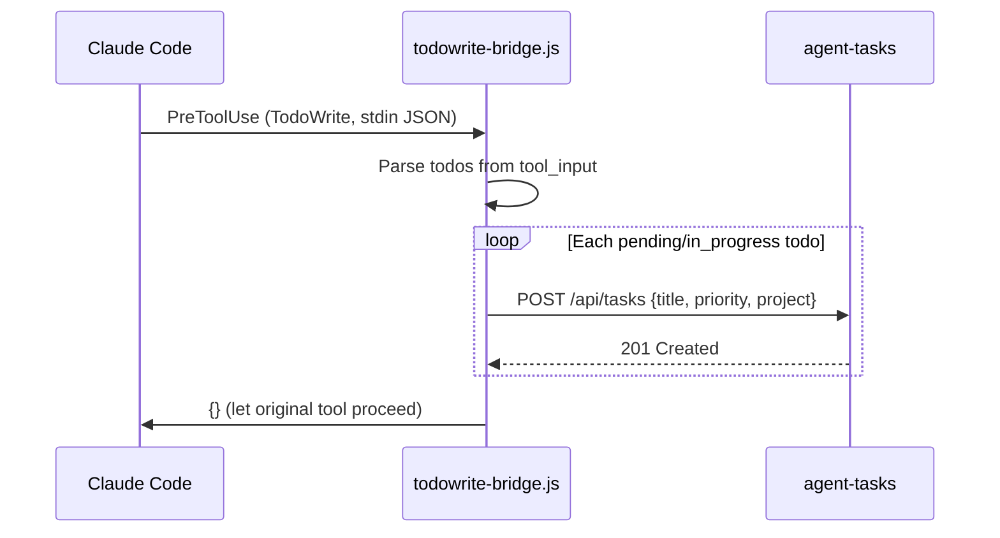

# Hooks (Claude Code)

agent-tasks ships with a TodoWrite bridge hook that intercepts Claude Code's built-in `TodoWrite` tool and syncs todos to the pipeline. This means every todo Claude creates automatically appears on your kanban board.

## TodoWrite Bridge (PreToolUse)

**File:** `hooks/todowrite-bridge.js`

When Claude Code calls `TodoWrite`, the hook:

1. Reads the tool input from stdin (JSON with `tool_name` and `tool_input`)
2. Extracts todos with `in_progress` or `pending` status
3. POSTs each as a new task to `http://localhost:3422/api/tasks`
4. Maps priority: `high` -> 10, `medium` -> 5, `low` -> 1
5. Tags all synced tasks with project `claude-todos`
6. Returns an empty JSON object to let the original tool proceed

### How it works



### Environment variables

| Variable          | Default                 | Description                   |
| ----------------- | ----------------------- | ----------------------------- |
| `AGENT_TASKS_URL` | `http://localhost:3422` | agent-tasks REST API base URL |

### Timeout

The hook has a 3-second timeout per task creation request. If agent-tasks is not running, the hook silently fails and lets the original `TodoWrite` proceed.

## Manual configuration

Add to `~/.claude/settings.json`:

```json
{
  "hooks": {
    "PreToolUse": [
      {
        "matcher": "TodoWrite",
        "command": "node \"/path/to/agent-tasks/hooks/todowrite-bridge.js\""
      }
    ]
  },
  "permissions": {
    "allow": ["mcp__agent-tasks__*"]
  }
}
```

Replace `/path/to/agent-tasks` with the actual path where you cloned the repo.

## Hook script

The bridge script is included in the repo at `hooks/todowrite-bridge.js`. Here is the full source for reference:

```javascript
#!/usr/bin/env node

// TodoWrite Bridge — syncs Claude Code todos to agent-tasks

import http from 'http';

const AGENT_TASKS_URL = process.env.AGENT_TASKS_URL || 'http://localhost:3422';

function postTask(task) {
  return new Promise((resolve) => {
    const data = JSON.stringify(task);
    const url = new URL('/api/tasks', AGENT_TASKS_URL);
    const req = http.request(
      {
        hostname: url.hostname,
        port: url.port,
        path: url.pathname,
        method: 'POST',
        headers: {
          'Content-Type': 'application/json',
          'Content-Length': Buffer.byteLength(data),
        },
        timeout: 3000,
      },
      (res) => {
        let body = '';
        res.on('data', (c) => (body += c));
        res.on('end', () => resolve(body));
      },
    );
    req.on('error', () => resolve(null));
    req.on('timeout', () => {
      req.destroy();
      resolve(null);
    });
    req.write(data);
    req.end();
  });
}

async function main() {
  let input = '';
  for await (const chunk of process.stdin) {
    input += chunk;
  }

  try {
    const event = JSON.parse(input);
    if (event.tool_name === 'TodoWrite' && event.tool_input) {
      const todos = event.tool_input.todos || [];
      for (const todo of todos) {
        if (todo.status === 'in_progress' || todo.status === 'pending') {
          await postTask({
            title: todo.content,
            priority: todo.priority === 'high' ? 10 : todo.priority === 'medium' ? 5 : 1,
            project: 'claude-todos',
          });
        }
      }
    }
  } catch {
    /* ignore parse errors */
  }

  // Return empty object to let the original tool proceed
  console.log(JSON.stringify({}));
}

main();
```

## Verifying the hook

1. Start agent-tasks (`npm start` or `npm run start:server`)
2. Start a Claude Code session
3. Ask Claude to create some todos
4. Open http://localhost:3422 — todos should appear in the `backlog` column with project `claude-todos`

If todos don't appear:

- Verify the hook script path is absolute in `settings.json`
- Check that agent-tasks is running (`curl http://localhost:3422/health`)
- The bridge logs errors to stderr with `[todowrite-bridge]` prefix
